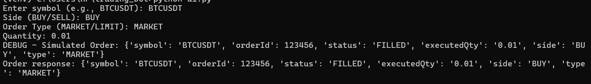

# Binance Trading Bot 

This is a simplified Binance Futures trading bot built in Python, developed as part of a technical assignment for a Junior Python Developer Internship.

---

## 🔧 Features Implemented

* ✅ Place Market and Limit Orders
* ✅ Supports Buy and Sell operations
* ✅ Works with Binance Futures Testnet
* ✅ Command-line interface for user interaction
* ✅ Input validation (symbol, order type, price, quantity)
* ✅ Logging (to `bot.log`)
* ✅ BONUS: Stop-Limit Order support

---

## 📁 File Structure

```
trading_bot/
├── bot.py            # Main trading logic using Binance API
├── config.py         # Contains API Key and Secret (Testnet)
├── ui.py             # Command-line interface to place orders
├── utils.py          # Input validation logic
├── requirements.txt  # Dependencies
└── README.md         # Project documentation (this file)
```

---

## 📦 How to Run

### 1. Clone the Repo

```bash
git clone https://github.com/yourusername/TradingBot.git
cd binance-trading-bot
```

### 2. Set up a Virtual Environment (optional)

```bash
python -m venv venv
source venv/bin/activate  # Or: venv\Scripts\activate (Windows)
```

### 3. Install Dependencies

```bash
pip install -r requirements.txt
```

### 4. Run the Bot

```bash
python ui.py
```
## 🖥️ Demo  

###  Placing a Market Order  
  


## 💬 Notes

* This project was developed for an internship assignment
* The bot operates on Binance Futures Testnet only
* All trades are simulated (no real funds involved)

---
